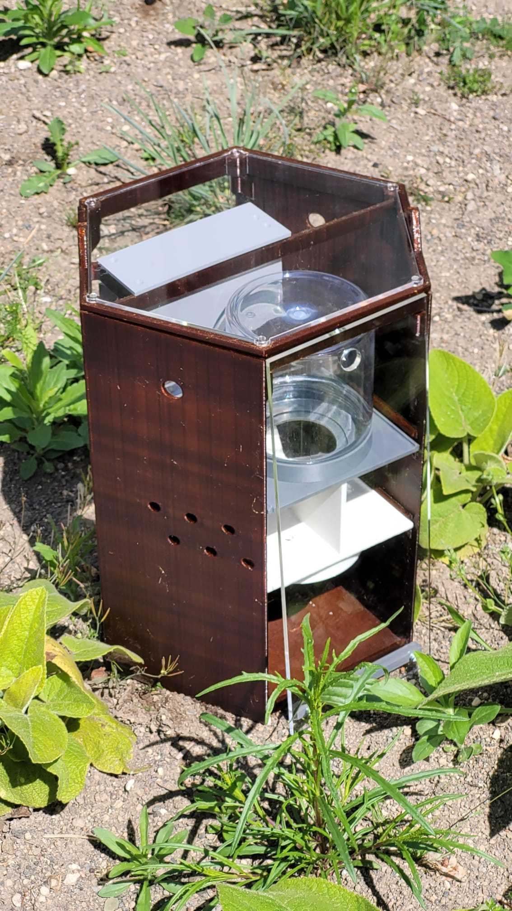
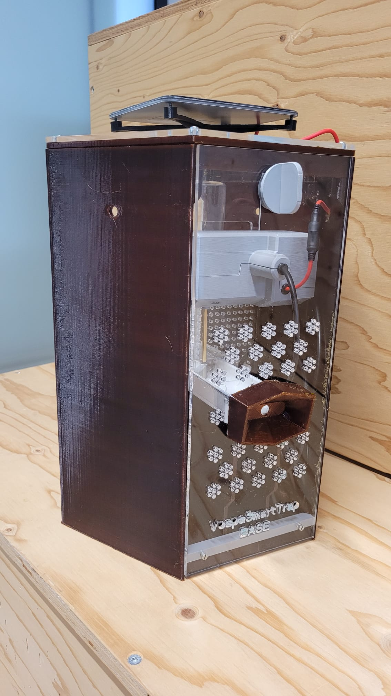
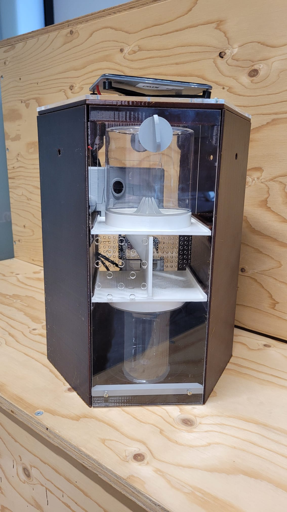

# 3D Housing and Mechanical Prototype

This folder contains the mechanical documentation for the physical camera-trap housing used by the Vespa Smart Trap prototype. It covers the enclosure, removable panels, bait/trap access, service checks, and CAD source files for the current prototype body.

## Prototype Photos

| Field prototype | Front/service side | Internal trap path |
| --- | --- | --- |
|  |  |  |

The prototype uses a smoked/transparent outer housing with internal printed parts for the bait area, funnel/trap path, service access, and electronics/camera mounting. The photos also show the top-mounted solar panel and external charging/data access.

## Primary Documents

- [Prototype field test manual](Concept_VespaSmartTrap-ONE_InstuctionMAnual_v02.pdf)  
  Field-test user manual for VespaSmartTrap-ONE. It includes setup, startup indicators, panel removal, bait replacement, trapped hornet removal, health checks, charging/data access, and daily test logging.
- [Prototype drawing PDF](ixid00000p5000_proto.pdf)  
  Mechanical drawing pack with front/back views, isometric views, exploded views, removal steps, plug access, and setup check drawings.

## CAD Assets

- [Assembly STEP model](ixid00000p5000_proto_asm.stp)  
  Main CAD interchange file for the prototype assembly. Use this as the source for CAD inspection, modification, and exporting derived print/manufacturing files.
- [U3D model](ixid00000p5000_proto.u3d)  
  3D model asset used for interactive/embedded 3D PDF workflows.
- [DWG drawing views](260622_isoviews_pdf_dwg/)  
  AutoCAD drawing files for each documented view and service step.

## DWG View Set

The `260622_isoviews_pdf_dwg` folder contains the drawing source for the PDF view sequence:

1. [Front/back views](260622_isoviews_pdf_dwg/ixid00000p5000_proto_1_views.dwg)
2. [Isometric view](260622_isoviews_pdf_dwg/ixid00000p5000_proto_2_iso.dwg)
3. [Front exploded view](260622_isoviews_pdf_dwg/ixid00000p5000_proto_3_explode_front.dwg)
4. [Back exploded view](260622_isoviews_pdf_dwg/ixid00000p5000_proto_4_explode_back.dwg)
5. [Explanation view](260622_isoviews_pdf_dwg/ixid00000p5000_proto_5_explain.dwg)
6. [Remove back panel](260622_isoviews_pdf_dwg/ixid00000p5000_proto_6_remove_backpanel.dwg)
7. [Remove trap](260622_isoviews_pdf_dwg/ixid00000p5000_proto_7_remove_trap.dwg)
8. [Remove bait](260622_isoviews_pdf_dwg/ixid00000p5000_proto_8_remove_bait.dwg)
9. [Remove front panel](260622_isoviews_pdf_dwg/ixid00000p5000_proto_9_remove_front_panel.dwg)
10. [Open plug](260622_isoviews_pdf_dwg/ixid00000p5000_proto_10_open_plug.dwg)
11. [Setup check](260622_isoviews_pdf_dwg/ixid00000p5000_proto_11_setup_check.dwg)

## Relationship to the Electronics

The housing is the mechanical counterpart to the VST-BASE electronics and firmware:

- [Project overview](../README.md)
- [System architecture](../docs/architecture.md)
- [T-SIM receiver firmware](../t-sim/README.md)
- [GV2 camera/inference module](../gv2/README.md)
- [Direct GV2 to T-SIM protocol](../docs/direct-gv2-to-t-sim.md)
- [Custom PCB bring-up](../docs/custom-pcb-bringup.md)

The firmware-side actuation cycle is driven by the configured stepper motor behavior after a matching Vespa velutina detection. The mechanical model here documents the trap body and access flow around that actuator-driven path.

## Notes

- No standalone `.stl` files are currently present in this folder. The available manufacturing source is the STEP assembly plus DWG drawing set.
- Print settings, material choice, nozzle size, layer height, supports, and orientation are not specified in the checked-in files yet.
- The field-test manual is the best source for operational handling: cleaning, bait replacement, trap removal, charging, data access, and daily inspection.
