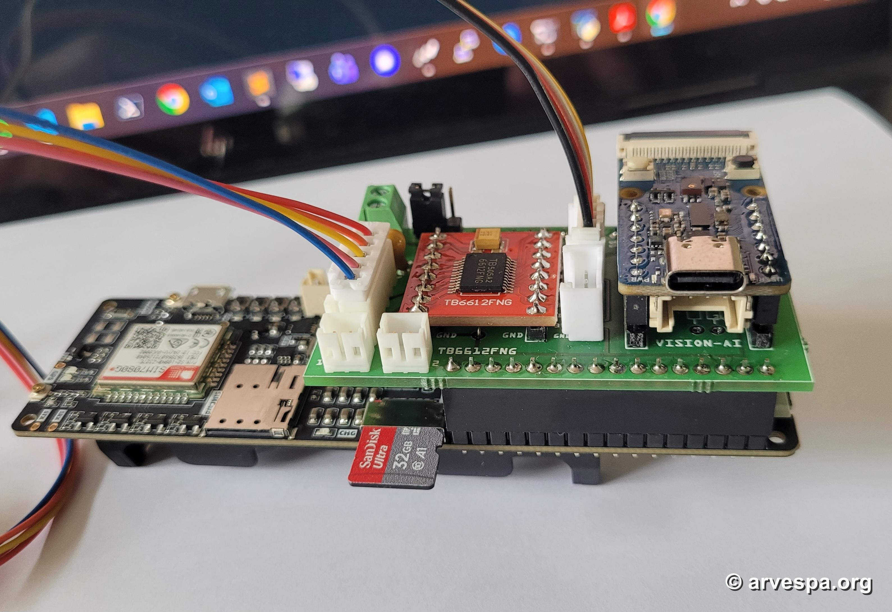

# VST-BASE



VST-BASE is the base-unit firmware, hardware integration reference, model tooling, and validation workspace for the Vespa Smart Trap project. The base unit is built around a LilyGO T-SIM7080G-S3 and receives inference metadata and JPEG frames from a Grove Vision AI V2 stick-on module through a custom PCB.

The root project is licensed under the GNU General Public License version 3.0. Keep source, build scripts, technical notes, and hardware references auditable and reproducible so that other developers can inspect, modify, rebuild, and redistribute the work under the repository's GNU license terms.

## Functionality

The current base firmware provides the following operational features:

- Power-on self test (POST) covering CPU, flash, heap, PSRAM, reset reason, SD card, configuration, modem, GNSS command path, UART, power telemetry, and actuator readiness.
- SD-MMC storage for configuration, boot reports, frame logs, power logs, and selected JPEG captures.
- SIM7080 modem initialization using TinyGSM, including AT readiness checks and network-time acquisition.
- Runtime Azure Blob upload of saved positive and configured doubtful detections, with independent cooldown and failure cooldown.
- Runtime SMS notification after positive detections, with provider-aware direct-SMS gating, recipient list, and cooldown.
- GNSS probing through the SIM7080 command interface, with optional GNSS UTC fallback when network time is unavailable and a trusted position is present.
- Binary UART receiver for the Grove Vision AI V2 module using `VSTS` state frames and `VSTJ` JPEG frames with metadata and CRC32 validation.
- Inference filtering by class, positive confidence threshold, doubtful confidence threshold, and consecutive occurrence count before actuation.
- TB6612FNG stepper output for a configurable actuator cycle, including an optional boot-time POST cycle and a detection-triggered cycle.
- WiFi web view in access-point or station mode, serving the latest verified frame and inference metadata over HTTP.
- JSON Lines frame logging with timestamp, GNSS data, inference result, bounding box, CRC status, actuator result, SMS/Azure result, saved filename, and firmware identity.
- Power telemetry logging to `/power.log` at a configurable interval.
- GV2 power control on the custom PCB: power down before deep sleep, power up after wake, and a short reset cycle before UART receive starts.
- Helper scripts for building and flashing the Grove Vision AI V2 firmware image and model.
- [VSTtool](https://vsttool.org) support for flashing firmware to the MCUs used in the project.
- Desktop image-viewer tooling and sample images for visual validation work.

## System Architecture

```text
T-SIM7080G-S3 base unit
        |
        +-- ESP32-S3 receiver firmware
        +-- SIM7080 modem time and GNSS probe
        +-- SD-MMC configuration, logs, and JPEG storage
        +-- WiFi HTTP image and state view
        +-- TB6612FNG stepper actuator output
        +-- USB serial POST and heartbeat monitor
        |
        +-- custom PCB interconnect
              |
              +-- Grove Vision AI V2 stick-on module
                    +-- camera
                    +-- YOLO11 object-detection model
                    +-- UART inference metadata and JPEG output
```

The T-SIM7080G-S3 is the base controller. The Grove Vision AI V2 is treated as an attached vision module, not as the system broker. The custom PCB provides the electrical and mechanical interface between the base, vision module, and actuator hardware references.

## Technical Specifications

| Area | Specification |
| --- | --- |
| Base board | LilyGO T-SIM7080G-S3, built as `esp32-s3-devkitc-1` |
| Framework | PlatformIO, Arduino ESP32 core |
| Firmware version | `0.2.0` in `firmware/src/version.h` |
| Flash | 16 MB, `huge_app.csv` partition table |
| PSRAM | Enabled, OPI/QIO memory configuration |
| USB serial | COM5 default, 115200 baud monitor |
| Upload | COM5 default, 921600 baud upload |
| GV2 UART | Serial2, GPIO 16 RX, GPIO 17 TX, 921600 baud default |
| GV2 protocol | `VSTS` state frames, `VSTJ` JPEG frames, CRC32 over JPEG payload |
| GV2 power control | GPIO 43 on the custom PCB, OFF during deep sleep and reset-cycled before UART start |
| Modem UART | Serial1, GPIO 4 RX, GPIO 5 TX |
| Modem power key | GPIO 41 |
| PMU | AXP2101 over I2C, SDA GPIO 15, SCL GPIO 7 |
| SD-MMC | 1-bit mode, CMD GPIO 39, CLK GPIO 38, DATA GPIO 40 |
| Actuator driver | TB6612FNG stepper output |
| Stepper pins | PWMA GPIO 9, AIN2 GPIO 10, AIN1 GPIO 11, BIN2 GPIO 12, BIN1 GPIO 13, PWMB GPIO 14 |
| Status output | Right LED / actuator-active signal on GPIO 3 / D0 |
| Web service | HTTP port 80, endpoints `/`, `/state.json`, `/frame.jpg` |
| Model target | Grove Vision AI V2 |
| Current model path | `external/gv2-firmware/model_zoo/tflm_yolo11_od/` |
| Current model file | `yolo11n_vespa_2026-02v1_allpxNULL_full_integer_quant_vela.tflite` |
| Model flash offset | `0xB7B000` |
| Model class short names | Configurable, defaults: `amel`, `vcra`, `vesp`, `vvel` |

## Repository Layout

```text
firmware/                     PlatformIO firmware for the T-SIM7080G-S3 base
firmware/src/                 Receiver firmware modules
firmware/platformio.ini       ESP32-S3 build, upload, monitor, and library config
firmware/huge_app.csv         16 MB flash partition table
docs/                         Architecture, protocol, hardware, GNSS, SD, and bring-up notes
docs/hardware/                Datasheets, pinouts, photos, and hardware references
external/gv2-firmware/        Submodule: Grove Vision AI V2 firmware fork and model zoo
external/t-sim-motor-shield/  Submodule: custom PCB / motor shield reference
tools/image-viewer/           Desktop random image viewer and sample images
tools/receiver/               Receiver helper scripts
tools/Himax_AI_web_toolkit/   Local copy of the Himax web flashing toolkit
build_gv2_image.ps1           GV2 firmware image build helper
flash_gv2.ps1                 GV2 firmware and model flash helper
```

Submodules are intentionally kept under `external/` to make ownership and licensing boundaries clear.

## Firmware Boot Flow

At startup the receiver:

1. Starts USB serial and prints system information.
2. Initializes the SD card, creates `/config.json` when missing, and loads runtime configuration.
3. Enables modem rails and probes SIM7080 AT readiness.
4. Validates LTE-M/APN when modem mode is `2`, using SIM identity profiles first and candidate probing as fallback.
5. Attempts to obtain network time and set system time.
6. Optionally sends a POST SMS probe when `sms.post_test_enabled` is true.
7. Powers and probes GNSS, optionally using trusted GNSS UTC as a fallback time source.
8. Powers the modem down after POST unless `modem.keep_alive_after_post` is true.
9. Starts the WiFi web service when enabled.
10. Initializes power telemetry and the stepper actuator.
11. Runs the optional stepper POST cycle when `stepper.post_test_enabled` is true.
12. Reset-cycles GV2 power on GPIO 43, starts GV2 UART, writes `/post.log`, and enters receive mode.

## UART Protocol

The base expects binary frames from the current GV2 firmware:

```text
State frame:
VSTS + state_u8

Heartbeat frame:
VSTH + status_u8 + counter_u32_le

JPEG frame:
VSTJ + state_u8 + class_idx_u8 + conf_u8
     + bbox_x_u16_le + bbox_y_u16_le + bbox_w_u16_le + bbox_h_u16_le
     + jpeg_len_u32_le + crc32_u32_le + jpeg_bytes
```

The GV2 heartbeat is an idle keepalive: it is sent after about 10 seconds of no other UART frames from GV2. A state change, JPEG frame, or error frame resets the heartbeat timer.

The JPEG payload length is the trimmed JPEG length through the actual `FFD9` marker. CRC32 is calculated over exactly those JPEG bytes. The receiver only treats a frame as complete after the declared payload has arrived, CRC32 matches, and the JPEG structure is valid.

## Detection And Actuation

The receiver evaluates each valid JPEG frame against the configured inference filter:

- `confidence_threshold`: required confidence as `0.0` to `1.0`.
- `doubtful_confidence_threshold`: lower confidence band used for evidence-only Azure upload.
- `detected_class`: target class index, or `-1` to accept any class.
- `occurrence`: number of consecutive matching frames required.
- `upload_doubtful_to_azure`: when true, saves and runtime-uploads matching-class frames between the doubtful and positive thresholds.

When the positive threshold and occurrence count are reached, the firmware runs the configured stepper actuator cycle, flushes and resynchronizes the UART receive path after the blocking actuator movement, saves the triggering JPEG when the SD card is available, optionally sends SMS, and attempts runtime Azure upload. The occurrence counter resets after the actuator event.

Doubtful frames do not trigger the stepper and do not send SMS. When enabled, they are saved and sent through the same runtime Azure upload path.

## SD Card Files

The firmware creates or writes these files on the SD card:

```text
/config.json                  Runtime configuration, created if missing
/post.log                     Boot POST summary, overwritten each boot
/frames.log                   JSON Lines frame and detection log
/power.log                    JSON Lines power telemetry log
/vvel_0.859_YYYYMMDD_HHMMSS_000123.jpg Saved JPEGs with class short name and confidence
/vvel_0.859_uptime_0000000000_000123.jpg Fallback JPEG naming when time is unavailable
```

`/frames.log` includes device identity, firmware version, GNSS fields, inference state, bounding box, positive/doubtful filter result, CRC result, actuator result, SMS result, Azure result, cooldown status, and saved filename.

The firmware removes legacy Azure queue files (`/azure_queue.log`, `/azure_queue.work`, `/azure_queue.tmp`) on SD mount. New firmware does not use an upload queue.

## Configuration

Configuration is read from `/config.json` on the SD card. If it does not exist, the firmware writes a default file. Key fields include:

```json
{
  "schema_version": 1,
  "device_name": "VST-BASE",
  "uart": {
    "rx_gpio": 16,
    "tx_gpio": 17,
    "baud": 921600
  },
  "logging": {
    "post_log": "/post.log",
    "image_prefix": "/frame_"
  },
  "features": {
    "gnss_probe": true,
    "ack_frames": true
  },
  "time": {
    "network_timeout_seconds": 60,
    "allow_gnss_fallback": true
  },
  "modem": {
    "mode": 2,
    "apn": "onomondo",
    "apn_autodetect": true,
    "apn_test_all": false,
    "validate_http_egress": false,
    "operator_auto_select": true,
    "keep_alive_after_post": false,
    "wake_for_runtime_sms": true,
    "apn_candidates": [
      { "supplier": "Onomondo", "apn": "onomondo" },
      { "supplier": "KPNThings", "apn": "internet.m2m" },
      { "supplier": "Wireless Logic Benelux", "apn": "" },
      { "supplier": "ThingsData/Tele2 2G-4G", "apn": "m2m.tele2.com" },
      { "supplier": "ThingsData/Tele2 5G", "apn": "iot.tele2.com" }
    ],
    "sim_profiles": [
      {
        "supplier": "Onomondo",
        "apn": "onomondo",
        "direct_sms": false,
        "imsi_prefixes": ["23450", "23873"],
        "iccid_prefixes": ["894573"]
      },
      {
        "supplier": "KPNThings",
        "apn": "internet.m2m",
        "direct_sms": true,
        "imsi_prefixes": ["20408"],
        "iccid_prefixes": []
      },
      {
        "supplier": "ThingsData/Tele2 2G-4G",
        "apn": "m2m.tele2.com",
        "direct_sms": true,
        "imsi_prefixes": ["20402", "24007"],
        "iccid_prefixes": ["894620"]
      }
    ],
    "lookup_primary": "1.1.1.1",
    "lookup_secondary": "8.8.8.8"
  },
  "stepper": {
    "speed_steps_per_second": 400,
    "rotation_degrees": 90,
    "steps_per_revolution": 2048,
    "reverse_wait_ms": 1000,
    "start_direction": "ccw",
    "post_test_enabled": false
  },
  "inference": {
    "confidence_threshold": 0.80,
    "doubtful_confidence_threshold": 0.70,
    "upload_doubtful_to_azure": true,
    "detected_class": 3,
    "occurrence": 3,
    "class_names": [
      { "class": 0, "short": "amel", "name": "Apis mellifera" },
      { "class": 1, "short": "vcra", "name": "Vespa crabro" },
      { "class": 2, "short": "vesp", "name": "Vespula sp." },
      { "class": 3, "short": "vvel", "name": "Vespa velutina" }
    ]
  },
  "power": {
    "log_interval_seconds": 900,
    "deep_sleep": 2,
    "deep_sleep_start_hour": 18,
    "deep_sleep_end_hour": 6,
    "low_battery_sleep_percent": 10,
    "low_battery_wake_interval_minutes": 60,
    "reboot_cron": "",
    "reboot_after_deep_sleep_wakeup": false
  },
  "health": {
    "led": 1
  },
  "azure": {
    "cooldown_minutes": 15,
    "failure_cooldown_seconds": 120,
    "runtime_connect_timeout_seconds": 20
  },
  "sms": {
    "enabled": false,
    "post_test_enabled": false,
    "runtime_settle_ms": 2000,
    "runtime_delay_after_detection_seconds": 0,
    "runtime_submit_timeout_ms": 60000,
    "cooldown_minutes": 15,
    "failure_cooldown_seconds": 900,
    "recipients": []
  },
  "web": {
    "mode": 2,
    "ssid": "VST-BASE",
    "password": "",
    "append_mac": true
  }
}
```

`device_name` is suffixed at runtime with the WiFi MAC suffix, matching the web SSID style, for example `VST-BASE-A62E94`. `web.mode` values are `0` for disabled, `1` for WiFi station mode, and `2` for access-point mode. `stepper.start_direction` accepts common clockwise and counter-clockwise forms such as `cw`, `clockwise`, `ccw`, and `anti-clockwise`.

Azure upload is runtime-only. A saved positive or configured doubtful image is uploaded immediately when the Azure cooldown allows. If cooldown is active the image remains saved on SD but is not queued. If upload fails, the failure cooldown is applied and the image is not queued.

SMS is runtime-only unless `sms.post_test_enabled` is explicitly true. `sms.enabled` is authoritative: recipients may be present while SMS remains disabled. SMS is skipped for providers whose selected SIM profile has `direct_sms=false`, such as Onomondo in the default profile set.

The modem APN is selected from SIM identity first (`sim_profiles` by IMSI/ICCID prefixes), then by configured APN candidate probing. Known default profiles cover Onomondo, KPNThings, and ThingsData/Tele2 2G-4G.

`power.reboot_cron` uses a five-field cron-like schedule after valid system time is available. For example, `0 12 * * *` reboots daily at noon. Leave it empty to disable scheduled reboot.

Low-battery protection is separate from the scheduled sleep window. With the default settings, a battery-powered unit sleeps when the PMU reports `10%` or lower and wakes every `60` minutes to re-check the battery. If solar has recovered the battery above the configured threshold, normal startup continues; otherwise it returns to deep sleep before modem, web, stepper, or GV2 runtime work starts.

## Build And Flash The Base Firmware

Install PlatformIO, connect the T-SIM7080G-S3, then run:

```powershell
cd firmware
.\run.ps1
```

The helper uploads to COM5 and opens the serial monitor on COM5 at 115200 baud by default. Override the ports when needed:

```powershell
.\run.ps1 -UploadPort COM5 -MonitorPort COM5
```

The underlying PlatformIO environment is `t-sim7080g-s3`.

[VSTtool](https://vsttool.org) also exists as a dedicated flashing utility for firmware updates on the MCUs used by VST-BASE. Use it when you need a single tool-oriented flashing workflow instead of the board-specific helper scripts above and below.

## Build And Flash The GV2 Firmware

Initialize submodules before building GV2 assets:

```powershell
git submodule update --init --recursive
```

Build the GV2 firmware image:

```powershell
.\build_gv2_image.ps1
```

Flash the GV2 firmware image and model:

```powershell
.\flash_gv2.ps1 -Port COM7
```

The flash helper uses `external/gv2-firmware/xmodem/xmodem_send.py` and expects the generated image at:

```text
external/gv2-firmware/we2_image_gen_local/output_case1_sec_wlcsp/output.img
```

Large model binaries should remain in the GV2 firmware submodule unless they are intentionally copied into this repository for a release package.

## Dependencies

Base firmware dependencies are declared in `firmware/platformio.ini`:

- Arduino ESP32 core through PlatformIO `espressif32`.
- TinyGSM from `https://github.com/vshymanskyy/TinyGSM.git`.
- XPowersLib by `lewisxhe` for AXP2101 PMU support.
- ArduinoJson `^7.0.0`.
- ESP32 Arduino built-ins such as `SD_MMC`, `WiFi`, and `WebServer`.

GV2 firmware dependencies are managed inside the `external/gv2-firmware` submodule.

## External Repositories

```text
external/gv2-firmware
  url:    https://github.com/marcory-hub/Seeed_Grove_Vision_AI_Module_V2.git
  branch: yolo11-vespa

external/t-sim-motor-shield
  url:    https://github.com/aggerritsen/T-SIMMotorShield.git
  branch: master
```

Clone with submodules:

```powershell
git clone --recurse-submodules <repo-url>
```

Or initialize them after cloning:

```powershell
git submodule update --init --recursive
```

## Public Development And GNU Licensing

This repository is licensed under the GNU General Public License version 3.0. See `LICENSE` for the full license text. For public releases, keep these practices in place:

- Preserve license notices in source files and third-party materials.
- Keep submodules and bundled tools in clearly separated directories so their upstream licenses remain identifiable.
- Document generated firmware, model binaries, and hardware artifacts well enough that users can rebuild or replace them.
- Avoid committing private credentials, SIM/APN secrets, WiFi passwords, certificates, or personal device identifiers.
- Prefer reproducible build commands and versioned configuration over local-only IDE state.

Third-party submodules and bundled tools may have their own licenses. Review those license files before redistributing combined firmware images, model packages, or hardware packages.

## Documentation Index

- `firmware/README.md`: detailed receiver firmware behavior, pins, protocol, validation, and source-file map.
- `docs/architecture.md`: high-level hardware and firmware architecture.
- `docs/receiver-post.md`: POST behavior.
- `docs/sd-card-layout.md`: SD output notes.
- `docs/gv2-model-flashing.md`: GV2 firmware and model flashing notes.
- `docs/custom-pcb-bringup.md`: custom PCB bring-up guidance.
- `docs/gnss.md`: GNSS notes.
- `docs/hardware/`: pinouts, datasheets, board photos, and hardware references.

## Development Notes

- Keep base application changes in `firmware/`.
- Keep GV2 firmware and model work in `external/gv2-firmware/`.
- Keep custom PCB and motor shield reference work in `external/t-sim-motor-shield/`.
- Update this README and the relevant detailed docs when changing public behavior, binary protocols, default pins, SD file formats, model names, or license posture.
