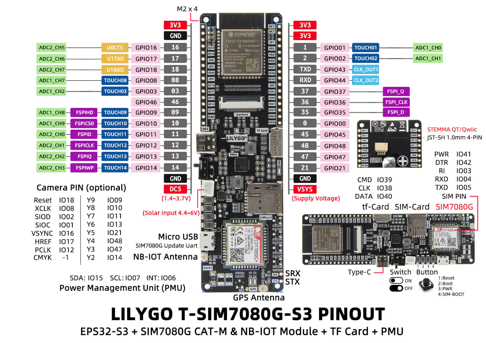

# T-SIM7080G-S3 Base Firmware

This PlatformIO project contains the owned receiver firmware for the VST-BASE T-SIM7080G-S3 base unit.

The firmware receives binary inference state and JPEG frames from the Grove Vision AI V2 stick-on module over the custom PCB UART link. It performs boot diagnostics, initializes the modem and SD card, writes POST/frame logs, validates inference/JPEG frames, runs the configured stepper actuator cycle after consecutive matching detections, and saves matching JPEGs to SD.

## Hardware Role

```text
Grove Vision AI V2 stick-on module
        |
        | UART2, 921600 baud, custom PCB
        v
T-SIM7080G-S3 base firmware
        |
        +-- SIM7080 modem time
        +-- SIM7080 GNSS probe
        +-- SD-MMC image and POST logging
        +-- TB6612FNG stepper actuator output
        +-- USB serial POST/heartbeat monitor
```

## Board Pinout



For more board details, see the [LilyGO T-SIM7080G repository](https://github.com/Xinyuan-LilyGO/LilyGo-T-SIM7080G).

## Pins And Ports

| Function | Pin / Port | Notes |
| --- | --- | --- |
| USB serial monitor | COM5, 115200 baud | POST and heartbeat output |
| PlatformIO monitor | COM5, 115200 baud | Configured in `platformio.ini` |
| GV2 UART RX | GPIO 16 default, Serial2 RX | Configurable via `/config.json` |
| GV2 UART TX | GPIO 17 default, Serial2 TX | Configurable via `/config.json` |
| GV2 UART baud | 921600 | 4096-byte RX/TX buffers |
| Modem RX | GPIO 4, Serial1 RX | SIM7080 AT interface |
| Modem TX | GPIO 5, Serial1 TX | SIM7080 AT interface |
| Modem PWRKEY | GPIO 41 | Pulsed if AT does not respond |
| PMU SDA | GPIO 15 | AXP2101 I2C |
| PMU SCL | GPIO 7 | AXP2101 I2C |
| SD CMD | GPIO 39 | SD-MMC 1-bit mode |
| SD CLK | GPIO 38 | SD-MMC 1-bit mode |
| SD DATA | GPIO 40 | SD-MMC 1-bit mode |
| Right LED / actuator active | GPIO 3 / D0 | HIGH while the configured stepper actuator cycle is in progress, including POST test |
| Stepper PWMA | GPIO 9 | TB6612FNG channel A PWM |
| Stepper AIN2 | GPIO 10 | TB6612FNG channel A input |
| Stepper AIN1 | GPIO 11 | TB6612FNG channel A input |
| Stepper BIN2 | GPIO 12 | TB6612FNG channel B input |
| Stepper BIN1 | GPIO 13 | TB6612FNG channel B input |
| Stepper PWMB | GPIO 14 | TB6612FNG channel B PWM |

## Boot Flow

On startup, `setup()` performs:

1. Starts USB serial and prints system information.
2. Enables modem rails through the AXP2101 PMU.
3. Probes the SIM7080 with AT commands.
4. Enables modem network time commands and waits for registration.
5. Reads `AT+CCLK?` into `YYYYMMDD_HHMMSS` format and sets system time if valid.
6. Powers GNSS with `AT+CGNSPWR=1` and samples `AT+CGNSINF` for up to 10 seconds.
7. Initializes UART2 for the GV2 link.
8. Initializes SD-MMC with custom T-SIM7080G-S3 pins.
9. Ensures `/config.json` exists and loads stepper settings.
10. Initializes the TB6612FNG stepper output.
11. Writes `/post.log` to the SD card when the card is available.
12. Prints a POST summary.
13. Runs one stepper POST test cycle: configured rotation forward, waits `reverse_wait_ms`, configured rotation reverse.
14. Enters receive mode.

Every 5 seconds the loop prints a diagnostic heartbeat with heap, modem, time, GNSS, UART, SD, and receive counters. GV2 receive output is event-driven: the important line is printed when a JPEG frame has fully arrived and has been validated, filtered, optionally actuated, and optionally saved.

## UART Protocol

The receiver expects binary frames from the current GV2 firmware.

```text
State frame:
VSTS + state_u8

JPEG frame:
VSTJ + state_u8 + class_idx_u8 + conf_u8 + bbox_x_u16_le + bbox_y_u16_le + bbox_w_u16_le + bbox_h_u16_le + jpeg_len_u32_le + crc32_u32_le + jpeg_bytes
```

The JPEG header contains the best detection box from the GV2 inference result. The length is the trimmed JPEG payload length through the real `FFD9` marker. CRC32 is computed over exactly those JPEG bytes. The receiver prints completion output only after all `jpeg_len_u32_le` payload bytes are received, the CRC matches, and the configured inference filter has been evaluated.

## Receive State Machine

| State | Responsibility |
| --- | --- |
| Magic scan | Wait for `VSTS` or `VSTJ` |
| State frame | Read one state byte and update diagnostics |
| JPEG header | Read state, class, confidence, bounding box, payload length, and CRC32 |
| JPEG payload | Read exactly the declared JPEG bytes into RAM, validate CRC32/JPEG structure, update the consecutive detection count, actuate and save only on a configured detection match, and append `/frames.log` |

The parser continuously scans for magic bytes when idle, so it can resynchronize after noise or a discarded invalid frame.

## Validation

Before saving an image, the firmware checks:

- The binary frame has a valid non-zero JPEG length.
- The declared length does not exceed the receiver maximum.
- CRC32 over the received JPEG bytes matches the sender header.
- Inference confidence is equal to or greater than `inference.confidence_threshold`.
- Inference class equals `inference.detected_class`, unless the configured class is `-1`.
- The class/confidence filter has matched for `inference.occurrence` consecutive valid frames.
- SD card availability.

Invalid frames and non-matching detections are logged but not saved. Once the configured consecutive occurrence count is reached, the receiver runs the configured stepper actuator cycle first, then saves the JPEG.

## SD Card Output

The firmware writes:

```text
/config.json
/post.log
/frames.log
/20260504_163530_000123.jpg
```

`/config.json` is created with default future settings if it does not exist yet. `/post.log` is overwritten at boot and includes the software version from `src/version.h`. `/frames.log` is appended as JSON Lines. JPEG filenames use the known system timestamp plus a local receive counter. If system time is not available, the firmware falls back to an uptime-based name.

Each `/frames.log` line records timestamp, GNSS coordinates, inference state/class/confidence, configured inference filter, occurrence count, detection match result, bounding box, JPEG length, CRC, saved filename, current actuator settings, actuator activation result, device name, CPU make/model, and software version.

The stepper settings currently used are:

```json
{
  "stepper": {
    "speed_steps_per_second": 200,
    "rotation_degrees": 90,
    "steps_per_revolution": 2048,
    "reverse_wait_ms": 1000
  },
  "inference": {
    "confidence_threshold": 0.0,
    "detected_class": -1,
    "occurrence": 1
  }
}
```

UART pins can also be changed without rebuilding:

```json
{
  "uart": {
    "rx_gpio": 16,
    "tx_gpio": 17,
    "baud": 921600
  }
}
```

The default `steps_per_revolution` is `2048` for a 28BYJ-48 in full-step mode. The POST test cycle runs the configured rotation forward, waits `reverse_wait_ms`, then reverses by the same amount. `inference.confidence_threshold` is a `0.0` to `1.0` threshold, `inference.detected_class` is the target class index, and `inference.occurrence` is the number of consecutive matching detections required before actuation and saving. Use `-1` for `detected_class` to accept any class.

## Build And Flash

```powershell
cd firmware
.\run.ps1
```

`run.ps1` uploads to COM5 by default, then opens the serial monitor on COM5 at 115200 baud unless different ports are passed:

```powershell
.\run.ps1 -UploadPort COM5 -MonitorPort COM5
```

## Source Files

| File | Responsibility |
| --- | --- |
| `src/main.cpp` | POST reporting, setup orchestration, heartbeat |
| `src/modem.cpp` | AXP2101 rails, SIM7080 AT readiness, network time, GNSS probe |
| `src/modem.h` | Modem API and GNSS data structure |
| `src/sdcard.cpp` | SD-MMC custom pin setup, `/config.json`, `/post.log`, JPEG writing |
| `src/sdcard.h` | SD card API |
| `src/stepper.cpp` | TB6612FNG full-step actuator drive using config speed/rotation |
| `src/stepper.h` | Stepper API |
| `src/uart.cpp` | GV2 Serial2 binary `VSTS`/`VSTJ` receiver and JPEG streaming |
| `src/uart.h` | GV2 UART API and receive statistics |
| `src/version.h` | Software name and version used in POST and frame logs |
| `platformio.ini` | ESP32-S3 build, serial ports, PSRAM, 16 MB flash, dependencies |
| `huge_app.csv` | Partition table |

## Dependencies

- Arduino ESP32 core
- TinyGSM for SIM7080 AT support
- XPowersLib for AXP2101 PMU control
- SD_MMC from the ESP32 Arduino core
- ArduinoJson for `/config.json`
- ESP-IDF helpers through the Arduino build
