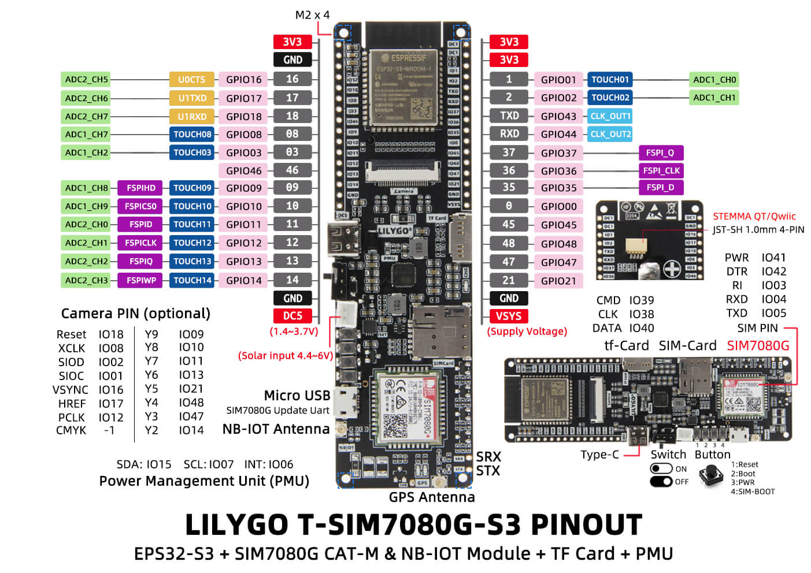

# T-SIM7080G-S3 Base Firmware

This PlatformIO project contains the owned receiver firmware for the VST-BASE T-SIM7080G-S3 base unit.

The firmware receives binary inference state and JPEG frames from the Grove Vision AI V2 stick-on module over the custom PCB UART link. It performs boot diagnostics, initializes the modem and SD card, writes POST/frame logs, validates inference/JPEG frames, runs the configured stepper actuator cycle after enough matching detections within the configured occurrence window, and saves matching JPEGs to SD.

## Hardware Role

```text
Grove Vision AI V2 stick-on module
        |
        | T-SIM Serial2, 921600 baud, custom PCB
        v
T-SIM7080G-S3 base firmware
        |
        +-- SIM7080 modem time
        +-- SIM7080 GNSS probe
        +-- SD-MMC image and POST logging
        +-- Optional WiFi HTTP image and inference view
        +-- TB6612FNG stepper actuator output
        +-- USB serial POST/heartbeat monitor
```

## Board Pinout



For more board details, see the [LilyGO T-SIM7080G repository](https://github.com/Xinyuan-LilyGO/LilyGo-T-SIM7080G).

## Pins And Ports

| Function | Pin / Port | Notes |
| --- | --- | --- |
| USB serial monitor | COM5, 115200 baud | POST and heartbeat output |
| PlatformIO monitor | COM5, 115200 baud | Configured in `platformio.ini` |
| GV2 UART RX | GPIO 16 default, Serial2 RX | Configurable via `/config.json` |
| GV2 UART TX | GPIO 17 default, Serial2 TX | Configurable via `/config.json` |
| GV2 UART baud | 921600 | 32 KB RX buffer for larger 4X JPEG bursts |
| GV2 power enable | GPIO 43 default | Drives the external BC337 low-side switch control: HIGH while awake, LOW before deep sleep |
| Modem RX | GPIO 4, Serial1 RX | SIM7080 AT interface |
| Modem TX | GPIO 5, Serial1 TX | SIM7080 AT interface |
| Modem PWRKEY | GPIO 41 | Pulsed if AT does not respond |
| PMU SDA | GPIO 15 | AXP2101 I2C |
| PMU SCL | GPIO 7 | AXP2101 I2C |
| SD CMD | GPIO 39 | SD-MMC 1-bit mode |
| SD CLK | GPIO 38 | SD-MMC 1-bit mode |
| SD DATA | GPIO 40 | SD-MMC 1-bit mode |
| D0 / actuator active | GPIO 3 / D0 | Custom PCB exposed output; HIGH while the configured stepper actuator cycle is in progress, including POST test |
| D1 / reserved input | GPIO 46 / D1 | Custom PCB exposed input-only line; reserved, not usable as a driven output |
| Stepper PWMA | GPIO 9 | TB6612FNG channel A PWM |
| Stepper AIN2 | GPIO 10 | TB6612FNG channel A input |
| Stepper AIN1 | GPIO 11 | TB6612FNG channel A input |
| Stepper BIN2 | GPIO 12 | TB6612FNG channel B input |
| Stepper BIN1 | GPIO 13 | TB6612FNG channel B input |
| Stepper PWMB | GPIO 14 | TB6612FNG channel B PWM |

## Boot Flow

On startup, `setup()` performs:

1. Starts USB serial and prints system information.
2. Initializes SD-MMC with custom T-SIM7080G-S3 pins.
3. Ensures `/config.json` exists, adds any missing default fields, and loads config.
4. Enables modem rails through the AXP2101 PMU.
5. Probes the SIM7080 with AT commands.
6. Runs the configured modem mode.
7. Reads `AT+CCLK?` into `YYYYMMDD_HHMMSS` format and sets system time if valid when modem time is enabled.
8. Powers GNSS with `AT+CGNSPWR=1` and samples `AT+CGNSINF` for up to 10 seconds when GNSS probing or fallback is enabled.
9. If configured local time is inside the deep-sleep window, stops the GV2 UART, sets the GV2 UART pins high-Z, drives the GV2 power-enable GPIO LOW, shuts down modem/GNSS rails, and enters ESP32 deep sleep until the configured wake hour.
10. Starts the WiFi web service when enabled in config.
11. Initializes power telemetry.
12. Initializes the TB6612FNG stepper output.
13. Runs one stepper POST test cycle: configured `start_direction`, waits `reverse_wait_ms`, configured return rotation.
14. Initializes `Serial2` for the GV2 link after the blocking POST test, so stale GV2 bytes cannot accumulate in the UART buffer during actuator movement.
15. Writes `/post.log` to the SD card when the card is available.
16. Prints a POST summary.
17. Enters receive mode.

The loop prints a diagnostic heartbeat with heap, modem, time, GNSS, UART, SD, and receive counters at the same cadence as `power.log_interval_seconds`. Power telemetry is queried and appended to `/power.log` only at that same interval. GV2 receive output is event-driven: the important line is printed when a JPEG frame has fully arrived and has been validated, filtered, optionally actuated, and optionally saved.

## UART Protocol

The receiver expects binary frames from the current GV2 firmware.

```text
State frame:
VSTS + state_u8

Heartbeat frame:
VSTH + status_u8 + counter_u32_le

JPEG frame:
VSTJ + state_u8 + class_idx_u8 + conf_u8 + bbox_x_u16_le + bbox_y_u16_le + bbox_w_u16_le + bbox_h_u16_le + jpeg_len_u32_le + crc32_u32_le + jpeg_bytes
```

The heartbeat is expected only as an idle keepalive, about every 10 seconds when GV2 has not sent a state change, JPEG frame, or error frame.

The JPEG header contains the best detection box from the GV2 inference result as `x,y,w,h` coordinates. The length is the trimmed JPEG payload length through the real `FFD9` marker. CRC32 is computed over exactly those JPEG bytes. The receiver prints completion output only after all `jpeg_len_u32_le` payload bytes are received, the CRC matches, and the configured inference filter has been evaluated.

## Receive State Machine

| State | Responsibility |
| --- | --- |
| Magic scan | Wait for `VSTS`, `VSTH`, `VSTE`, or `VSTJ` |
| State frame | Read one state byte and update diagnostics |
| Heartbeat frame | Read status and counter so health checks can distinguish "GV2 alive, no JPEG yet" from a dead camera path |
| JPEG header | Read state, class, confidence, bounding box, payload length, and CRC32 |
| JPEG payload | Read exactly the declared JPEG bytes into RAM, validate CRC32/JPEG structure, update the detection occurrence count, actuate and save only on a configured detection match, and append `/frames.log` |

The parser continuously scans for magic bytes when idle, so it can resynchronize after noise or a discarded invalid frame.

## Validation

Before saving an image, the firmware checks:

- The binary frame has a valid non-zero JPEG length.
- The declared length does not exceed the receiver maximum.
- CRC32 over the received JPEG bytes matches the sender header.
- Inference confidence is equal to or greater than `inference.confidence_threshold`.
- Inference class equals `inference.detected_class`, unless the configured class is `-1`.
- The class/confidence filter has matched for `inference.occurrence` valid frames within `inference.occurrence_window_seconds`.
- SD card availability.

Invalid frames and non-matching detections are logged but not saved. Once the configured occurrence count is reached inside the configured time window, the receiver runs the configured stepper actuator cycle first, flushes and resynchronizes the GV2 UART stream after the blocking actuator cycle, then saves the triggering JPEG. The detection occurrence counter is reset after a completed actuator event so a fresh set of matches is required before the next cycle.

## SD Card Output

The firmware writes:

```text
/config.json
/post.log
/frames.log
/power.log
/health.log
/log/archive/<YYYYMMDD>/*.jsonl
/vvel_0.859_20260716_225523_000004.jpg
```

`/config.json` is created with default future settings if it does not exist yet. `/post.log` is overwritten at boot and includes the software version from `firmware/src/version.h`. `/frames.log`, `/health.log`, and `/power.log` are appended as JSON Lines and rotated into `/log/archive/<YYYYMMDD>/` according to the logging policy. JPEG filenames include the configured class short name, confidence, known system timestamp, and local receive counter. If system time is not available, the firmware falls back to an uptime-based name.

The repository includes `config.example.json` as a clean, human-readable baseline for validating SD card configs. It intentionally contains no comment helper fields and no legacy GV2 reset settings.

Each `/frames.log` line records timestamp, GNSS coordinates, inference state/class/confidence, configured inference filter, occurrence count, detection match result, bounding box, JPEG length, CRC, saved filename, current actuator settings, actuator activation result, device name, CPU make/model, and software version.

The stepper settings currently used are:

```json
{
  "stepper": {
    "speed_steps_per_second": 400,
    "rotation_degrees": 90,
    "steps_per_revolution": 2048,
    "reverse_wait_ms": 1000,
    "start_direction": "cw",
    "post_test_enabled": true
  },
  "inference": {
    "confidence_threshold": 0.80,
    "doubtful_confidence_threshold": 0.70,
    "upload_doubtful_to_azure": true,
    "detected_class": 3,
    "occurrence": 3,
    "occurrence_window_seconds": 30
  }
}
```

UART pins can also be changed without rebuilding:

```json
{
  "uart": {
    "rx_gpio": 16,
    "tx_gpio": 17,
    "baud": 921600
  }
}
```

GV2 power switching is controlled at build time with `GV2_POWER_GPIO_CFG`, defaulting to GPIO 43 in `firmware/platformio.ini`. The pin is driven HIGH during boot/wake before the GV2 UART starts, and driven LOW immediately before deep sleep after the UART is stopped and its RX/TX pins are set to input/high-Z.

The modem mode controls how much of the SIM7080 is required for health:

```json
{
  "modem": {
    "mode": 2,
    "apn": "onomondo",
    "apn_autodetect": true,
    "apn_test_all": false,
    "operator_auto_select": false,
    "apn_candidates": [
      { "supplier": "Onomondo", "apn": "onomondo" },
      { "supplier": "KPNThings", "apn": "internet.m2m" },
      { "supplier": "Wireless Logic Benelux", "apn": "" },
      { "supplier": "ThingsData/Tele2 2G-4G", "apn": "m2m.tele2.com" },
      { "supplier": "ThingsData/Tele2 5G", "apn": "iot.tele2.com" }
    ],
    "lookup_primary": "1.1.1.1",
    "lookup_secondary": "8.8.8.8"
  }
}
```

| `modem.mode` | Behavior |
| --- | --- |
| `0` | No modem/SIM expected. Modem init, modem time, LTE-M validation, and GNSS probing through the modem are skipped. Modem health is ignored. |
| `1` | Time-only modem mode. The modem must answer AT commands, register on the network, provide valid `AT+CCLK?` time, and set system time. LTE-M bearer validation is skipped. |
| `2` | LTE-M validation mode. The modem must answer AT commands, register, attach with the configured APN, and obtain a bearer IP address. Modem time and GNSS probing are also attempted. |

When `apn_autodetect` is `true`, mode `2` tries each non-empty `apn_candidates` entry until LTE-M bearer/IP validation succeeds. By default validation stops at bearer/IP because SIM7080 TLS response timing is too variable for a reliable POST egress check. Set `validate_http_egress` to `true` only during modem diagnostics if a TinyGSM TLS connection to KPN Things should also be attempted. Each APN attempt is printed to serial and appended to `/health.log` as `modem_apn_probe` JSON Lines. The selected APN is kept in RAM as `modem.apn` for later health retries. Leave a supplier APN empty when it is not known yet; the firmware logs that candidate as skipped.

Set `apn_test_all` to `true` during supplier comparison tests to continue through every configured APN even after one APN passes. The first passing APN remains selected for later health retries.

For SIM supplier testing, use a longer `time.network_timeout_seconds` value such as `60` so roaming SIMs have enough time to leave `searching` registration states like `+CEREG: 2,2` before APN attach is declared failed.

When a positive detection match is saved to SD, the firmware can immediately upload that saved JPEG to Azure Blob Storage using the credentials compiled in `firmware/src/config_secrets.h`. During the upload it pauses the GV2 UART, wakes or reconnects the SIM7080 data bearer as needed, performs an HTTPS PUT, then resumes GV2 UART reception and applies `azure.cooldown_minutes`. Failed uploads apply `azure.failure_cooldown_seconds`. Set `azure.cooldown_minutes` high enough to avoid repeated modem wake/upload cycles during dense detections.

Doubtful frames, with confidence between `inference.doubtful_confidence_threshold` and `inference.confidence_threshold`, can also be saved and uploaded when `inference.upload_doubtful_to_azure` is true. They do not trigger the actuator unless they also satisfy the positive detection filter and occurrence count.

`time.allow_gnss_fallback=true` lets mode `1` or `2` try GNSS time when modem network time is unavailable. GNSS time is only trusted from a valid GNSS position fix or from a plausible UTC value that advances during the probe.

The web service is enabled as an access point by default. `mode` is `0` off, `1` WiFi station, or `2` access point:

```json
{
  "web": {
    "mode": 2,
    "ssid": "VST-BASE",
    "password": "",
    "append_mac": true
  }
}
```

Power telemetry is logged to `/power.log`. The interval is configured in seconds and also controls the heartbeat cadence:

```json
{
  "power": {
    "log_interval_seconds": 900,
    "deep_sleep": 2,
    "deep_sleep_start_hour": 18,
    "deep_sleep_end_hour": 6,
    "low_battery_sleep_percent": 10,
    "low_battery_wake_interval_minutes": 60,
    "reboot_cron": "0 12 * * *",
    "reboot_after_deep_sleep_wakeup": false
  },
  "health": {
    "led": 1
  },
  "azure": {
    "cooldown_minutes": 15,
    "failure_cooldown_seconds": 120,
    "runtime_connect_timeout_seconds": 20,
    "photos_prefix": "photos",
    "logs_prefix": "logs",
    "log_post_test_enabled": true
  }
}
```

`health.led` is `1` to blink the status LED with the health state while USB/VBUS power is present, or `0` to keep that runtime health blink off. The same status LED is driven on while the configured actuator cycle is running in any power mode.

`deep_sleep` is a mode value:

| Mode | Behavior |
| --- | --- |
| `0` | Deep sleep disabled |
| `1` | Sleep during the configured local-time window |
| `2` | Sleep during the configured local-time window only when running from battery |

Mode `2` requires the PMU to report that a battery is present, the battery is discharging, and no external VBUS input is detected. This is intended for overnight saving while still keeping the unit awake when 5V or solar input is available. The default window is `18:00-06:00`, so after a valid modem or GNSS time sync, a unit booting during the night can go back to sleep immediately when the mode allows it. Before sleeping, the firmware logs a `deep_sleep_enter` event to `/power.log`, stops the GV2 UART, drives the GV2 power-control signal on GPIO 43 LOW, shuts down GNSS/modem rails where possible, and arms the ESP32 timer wakeup.

Low-battery protection is independent of the night window. When a battery is present, no mains/VBUS input is detected, and `battery_percent` is less than or equal to `power.low_battery_sleep_percent`, the firmware enters deep sleep for `power.low_battery_wake_interval_minutes`. This check runs immediately after SD config and PMU init, before modem, web, stepper, or GV2 startup work, and it also runs during normal runtime. The default policy is to sleep at `10%` or lower and wake every `60` minutes to check whether solar charging has recovered the battery enough to continue. If the unit is already inside the programmed sleep window, or if the next low-battery check would land inside that window, the sleep is extended to the configured wake hour instead of doing hourly wakeups overnight.

`power.reboot_cron` is a five-field cron-like schedule checked once per loop minute after valid system time is available. It supports `*`, single values, comma lists, ranges, and `*/step`. For example, `"0 12 * * *"` reboots daily at noon. Leave it empty to disable scheduled reboot. `power.reboot_after_deep_sleep_wakeup=true` performs one immediate restart after waking from a firmware-entered deep sleep, then clears the RTC marker to avoid a reboot loop.

Rotated log uploads are controlled separately by `logging.upload_enabled`, `logging.upload_interval_minutes`, `logging.upload_max_files_per_run`, and `logging.upload_min_battery_percent`. They use `azure.logs_prefix` and delete local archive files after a successful upload.

During POST, missing `/config.json` fields are added back to the SD card from `config.example.json` without overwriting existing values. Existing values and extra user fields are preserved.

When enabled, open the IP printed as `WEB: ... ip=...` in the serial monitor. The page polls `/state.json` for inference metadata and fetches `/frame.jpg` only when a new verified frame id arrives, keeping the display path binary JPEG instead of base64. CRC-bad or structurally invalid JPEGs are logged but do not replace the last good web frame.

The default `steps_per_revolution` is `2048` for a 28BYJ-48 in full-step mode. `stepper.start_direction` accepts `clockwise`/`cw` or `anti-clockwise`/`ccw` and controls the first rotation of each POST or detection actuator cycle; the return rotation always runs in the opposite direction by the same amount. `inference.confidence_threshold` is a `0.0` to `1.0` threshold, `inference.detected_class` is the target class index, `inference.occurrence` is the number of matching detections required, and `inference.occurrence_window_seconds` is the time window for those matches. Use `-1` for `detected_class` to accept any class.

## Build And Flash

```powershell
cd firmware
.\run.ps1
```

`run.ps1` uploads to COM5 by default, then opens the serial monitor on COM5 at 115200 baud unless different ports are passed:

```powershell
.\run.ps1 -UploadPort COM5 -MonitorPort COM5
```

## Source Files

| File | Responsibility |
| --- | --- |
| `firmware/src/main.cpp` | POST reporting, setup orchestration, heartbeat |
| `firmware/src/modem.cpp` | AXP2101 rails, SIM7080 AT readiness, network time, GNSS probe |
| `firmware/src/modem.h` | Modem API and GNSS data structure |
| `firmware/src/sdcard.cpp` | SD-MMC custom pin setup, `/config.json`, `/post.log`, JPEG writing |
| `firmware/src/sdcard.h` | SD card API |
| `firmware/src/stepper.cpp` | TB6612FNG full-step actuator drive using config speed/rotation |
| `firmware/src/stepper.h` | Stepper API |
| `firmware/src/uart.cpp` | GV2 power control, Serial2 binary `VSTS`/`VSTJ` receiver, and JPEG streaming |
| `firmware/src/uart.h` | GV2 power/UART API and receive statistics |
| `firmware/src/web.cpp` | WiFi HTTP service serving latest JPEG, overlay page, and inference JSON |
| `firmware/src/web.h` | Web service API and published frame metadata |
| `firmware/src/version.h` | Software name and version used in POST and frame logs |
| `firmware/platformio.ini` | ESP32-S3 build, serial ports, PSRAM, 16 MB flash, dependencies |
| `firmware/huge_app.csv` | Partition table |

## Dependencies

- Arduino ESP32 core
- TinyGSM for SIM7080 AT support
- XPowersLib for AXP2101 PMU control
- SD_MMC from the ESP32 Arduino core
- WiFi and WebServer from the ESP32 Arduino core
- ArduinoJson for `/config.json`
- ESP-IDF helpers through the Arduino build
